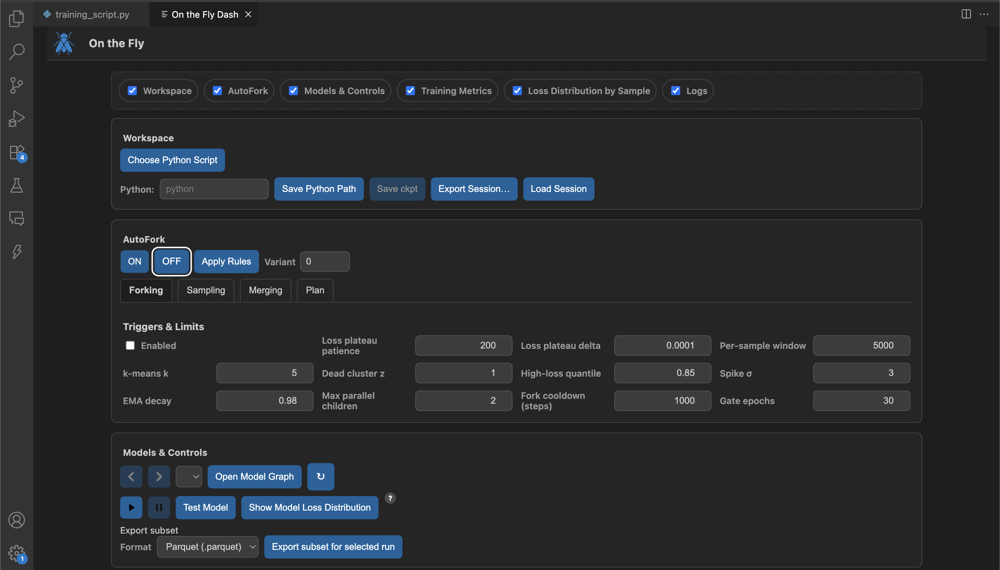

# On The Fly

**On The Fly** is the open-source ML **orchestration** platform that lets you take control **during** training. We want to reduce Time-to-Detection for failure cases with proactive decisions.



> [!IMPORTANT]
> **Project status: Beta.** APIs, UI flows, and file formats may change before v1.0. Expect rough edges and please report issues.

---

## Getting Started

### Install

```bash
pip install onthefly-ai
```

**Requirements**

* Python ≥ 3.9
* PyTorch ≥ 2.2 (CUDA 12.x optional)
* OS: Linux, macOS, or Windows
* Visual Studio Code

> **Sessions & storage**
>
> Every session is **ephemeral** in storage: when a new session begins, the previous session’s storage is cleaned up.
> Exporting a session is equivalent to saving a session.

### Quickstart

```python
import torch, torch.nn as nn
from torch.utils.data import DataLoader, TensorDataset
from onthefly import quickstart

# toy dataset
X = torch.randn(4096, 28*28)
y = (X[:, :50].sum(dim=1) > 0).long()
ds = TensorDataset(X, y)
train = DataLoader(ds, batch_size=128, shuffle=True)
val = DataLoader(ds, batch_size=256)
test = DataLoader(ds, batch_size=256)

# tiny model
model = nn.Sequential(nn.Linear(28*28, 64), nn.ReLU(), nn.Linear(64, 2))
opt = torch.optim.Adam(model.parameters(), lr=1e-3)
loss = nn.CrossEntropyLoss()

quickstart(
    project="mnist-demo",
    run_name="baseline",
    model=model,
    optimizer=opt,
    loss_fn=loss,
    train_loader=train,
    val_loader=val,
    test_loader=test,
    max_epochs=1,
    do_test_after=True,
)
```

Don't run this just yet, you're going to begin training using the dashboard controls.

### Open the VS Code dashboard

1. Open VS Code → Command Palette (`Ctrl/Cmd + Shift + P`).
2. Run **“On the Fly: Show Dashboard.”**
3. Select your Python interpreter and training script.
4. Press **▶ Run** to start/monitor training, inspect clusters, and compare experts.

---

## Features

* **Mid-training control & visibility** – Start training natively from the VS Code dashboard.
* **Hard-sample mining** – Stream per-sample loss (optionally grad-norm, margin) with robust quantiles; surface loss tails early.
* **Fork & specialize** – Create short-budget specialists from high-loss tails or residual clusters, then route with a lightweight gate.
* **Merge improvements** – SWA, distillation, Fisher Soup, or adapter fusion; compare experts side-by-side before merging.
* **Planner (Automode)** – An optional automated planner proposes/executes actions with safeguards (cooldowns, limits, diagnostics). You can intervene anytime.
* **Data export** – One-click export of indices/rows for any slice/cluster/tail to CSV/Parquet/JSON for notebooks, SQL, or BI tools.
* **MoE insight** – Inspect gate loads, expert ancestry, per-slice deltas, residual clusters, and trend tests without waiting for full epochs.
* **Ephemeral sessions & exports** – Every session is ephemeral in storage; storage is cleaned whenever a new session begins. Exporting a session is equivalent to saving it.
* **Backend-mirrored training** – Mirrors training in the app’s backend, encompassing any `torch.nn.Module` (including custom ones) and `DataLoader` workers.
* **Deterministic distributed runs** – Ensures deterministic actions across distributed set-ups, with a surfaceable deterministic health check-up for monitoring.
* **Mid-run health check-ups** – Run health check-ups mid-run to detect instability and configuration issues before they cascade.
* **Continuous training post-testing** – Continue training seamlessly after tests, whether testing was triggered by criteria or by a mid-run decision.
* **Checkpoint override on import** – Ability to override test checkpoints so that when a session is imported, the final model is always included.
* **Portable, traceable sessions** – All sessions are portable and traceable. Imported sessions can be acted on (e.g., reports, training, testing) just like live ones.

---

## Modes

### Manual mode (analyst-in-the-loop)

Keep full control with **Automode OFF**. Pause runs, inspect evidence, export subsets, then decide when to fork or merge.

**What you can do**

* **Pause/Resume** at any time to take a clean snapshot.
* **Inspect before acting**: View per-sample loss distributions, export subsets for offline analysis.
* **Approve or edit plan cards** prior to execution.
* **Compare experts** on target slices.
* **Merge on your terms** via SWA / Distill / Fisher-Soup / Adapter-Fuse.
* **Merge on your terms**: View model parent/children in lineage graph.
* **Run health check-ups mid-run** to validate determinism, gradients, and metrics before committing to longer budgets.
* **Export & import sessions** knowing that exported sessions include the final model and can later be imported, tested, and trained further.

**Typical manual loop**

1. Pause when drift or a weak slice appears.
2. Inspect loss tails, export a subset for a quick notebook check.
3. Fork a short-budget specialist for chosen samples, with desired parameters.
4. Evaluate on target slices; iterate if needed.
5. Merge improvements and resume training.
6. Export the session for traceability, or import a prior session to continue training or generate reports.

### Automode (automated planner)

With **Automode ON**, plans execute immediately with safeguards. You can intervene at any time.

Automode monitors the run and proposes/executes plans such as:

* **Stabilize on instability:** Detect NaNs/Inf, loss/grad spikes, sharpness/GNS alerts; try LR↓, WD↑, gradient clipping, bf16; optional SAM/EMA.
* **Mine hard samples:** Track per-sample loss and other signals with robust quantiles.
* **Cluster residuals (auto-k):** Tag high-loss clusters; fall back to top-q loss tails when appropriate.
* **Specialize with budgets:** Launch short ASHA/Successive-Halving rungs for candidate specialists.
* **Route with a gate:** Train a small router (`switch_softmax` by default; temperature + load-balance aux).
* **Explore on plateaus:** Trend tests (Theil–Sen + Mann–Kendall; Page–Hinkley aware) trigger small HPO sweeps with early stop.
* **Target weak slices:** If you report per-slice validation metrics, persistent underperformers trigger slice-focused forks.
* **Merge on cadence:** Periodically unify via SWA / Distill / Fisher-Soup / Adapter-Fuse; parent remains catch-all.
* **Pacing & limits:** Adaptive cooldowns; cap parallel children; lightweight diagnostics in the UI.
* **Deterministic health checks:** Periodically verify deterministic behavior across distributed set-ups so actions and outcomes remain reproducible.
* **Continuous post-test training:** After tests (criteria-based or manual), automatically resume or extend training according to planner policy, keeping sessions portable and exportable at every step.

**Planner card (summary fields)**

```text
action: fork | merge
reason: instability_spike | residual_cluster | high_loss_tail | loss_plateau | slice_underperformance
selection: {kind: all | quantile | kmeans | indices, ...}
training_recipe: small set of variants + early stopping
gate_recipe: tiny router (if specializing)
merge_recipe: swa | distill | fisher_soup | adapter_fuse
budget_steps: short (ASHA first rung)
cooldown_steps: adaptive
diagnostics: lightweight numbers for the UI
```

**Selection cheatsheet**

* `all` — global stabilize/explore
* `quantile` — top-q loss tail (e.g., 0.85–1.0)
* `kmeans` — cluster IDs from auto-k residual clustering
* `indices` — exact sample IDs (if provided)

---

## Method (at a glance)

> Train a generalist, mine and cluster hard samples into regimes, train specialists, learn a gating network, and export a unified MoE for inference.

1. Train a compact **generalist** on all data.
2. **Hard-sample mining** flags high-loss examples online.
3. **Clustering** groups hard samples into candidate regimes.
4. Train **per-regime specialists**.
5. Learn a **gating network** to mix experts.
6. **Benchmark fairly** against a monolithic baseline with matched compute.

---

## Reproducible examples

See `examples/` for training scripts that illustrate the workflow without hyper-parameter tuning.

---

## Troubleshooting

* **No GPU visible:** set `CUDA_VISIBLE_DEVICES` or install matching CUDA wheels.
* **VS Code command missing:** ensure the extension is enabled; restart VS Code.

---

## License

[Apache-2.0](LICENSE)

---

## Citation

If you use this project in research, please cite:

```bibtex
@software{onthefly2025,
  title        = {On The Fly: Human-in-the-Loop ML Orchestrator},
  author       = {Luke Skertich},
  year         = {2025},
  url          = {https://github.com/KSkert/onthefly}
}
```
