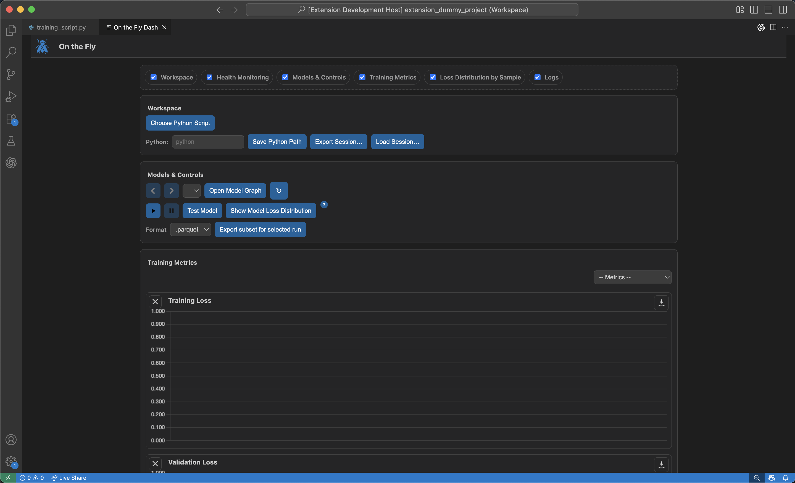

# On The Fly

**On The Fly** is the open-source ML **orchestration** platform offering real-time capabilities during training and insights side-by-sde with your ML development. Take control **during** training, fully offline and portable with no externals, no cloud, or tokens needed. The app supports model management during training -- not after -- letting you reduce Time-to-Detection for failure cases with proactive decisions. Testing can be done any time; training is continuous after testing.



> [!IMPORTANT]
> **Project status: Beta.** APIs, UI flows, and file formats may change before v1.0. Expect rough edges and please report issues.

---

## Getting Started

### Install

```bash
pip install onthefly-ai
```

**Requirements**

* Python ≥ 3.9
* PyTorch ≥ 2.2 (CUDA 12.x optional)
* OS: Linux, macOS, or Windows
* Visual Studio Code

> **Sessions & storage**
>
> Every session is **ephemeral** in storage: when a new session begins, the previous session’s storage is cleaned up.
> Exporting a session is equivalent to saving a session.

### Quickstart

```python
import torch, torch.nn as nn
from torch.utils.data import DataLoader, TensorDataset
from onthefly import quickstart

# toy dataset
X = torch.randn(4096, 28*28)
y = (X[:, :50].sum(dim=1) > 0).long()
ds = TensorDataset(X, y)
train = DataLoader(ds, batch_size=128, shuffle=True)
val = DataLoader(ds, batch_size=256)
test = DataLoader(ds, batch_size=256)

# tiny model
model = nn.Sequential(nn.Linear(28*28, 64), nn.ReLU(), nn.Linear(64, 2))
opt = torch.optim.Adam(model.parameters(), lr=1e-3)
loss = nn.CrossEntropyLoss()

quickstart(
    project="mnist-demo",
    run_name="baseline",
    model=model,
    optimizer=opt,
    loss_fn=loss,
    train_loader=train,
    val_loader=val,
    test_loader=test,
    max_epochs=1,
    do_test_after=True,
)
```

Don't run this just yet, you're going to begin training using the dashboard controls.

### Open the VS Code dashboard

1. Open VS Code → Command Palette (`Ctrl/Cmd + Shift + P`).
2. Select the **“On the Fly: Show Dashboard.”** Command.
3. Select your Python interpreter and training script.
4. Press **▶ Run** to start/monitor training, inspect clusters, and compare experts.

---

## Features

* **Mid-training control & visibility** – Start training natively from the VS Code dashboard.
* **Hard-sample mining** – Stream per-sample loss (optionally grad-norm, margin) with robust quantiles; surface loss tails early.
* **Fork & specialize** – Create short-budget specialists from high-loss tails or residual clusters, then route with a lightweight gate.
* **Merge models** – SWA, distillation, Fisher Soup, or adapter fusion; compare experts side-by-side before merging.
* **Data export** – One-click export of indices/rows for any slice to CSV/Parquet/JSON.
* **Ephemeral sessions & exports** – Every session is ephemeral in storage; storage is cleaned whenever a new session begins. Exporting a session is equivalent to saving it.
* **Backend-mirrored training** – Mirrors training in the app’s backend, encompassing any `torch.nn.Module` (including custom ones) and `DataLoader` workers.
* **Deterministic distributed runs** – Ensures deterministic actions across distributed set-ups, with a surfaceable deterministic health check-up for monitoring.
* **Mid-run health check-ups** – Run health check-ups mid-run to detect instability and configuration issues before they cascade.
* **Continuous training post-testing** – Continue training seamlessly after tests, whether testing was triggered by criteria or by a mid-run decision.
* **Checkpoint override on import** – Ability to override test checkpoints so that when a session is imported, the final model is always included.
* **Portable sessions** – All sessions are portable and traceable. Imported sessions can be acted on (e.g., reports, training, testing) just like live ones.

---

## Manual human-in-the-loop

Keep full control with deterministic actions. Inspect evidence, export subsets, then decide when to fork or merge.

**What you can do**

* **Pause/Resume** at any time to take a clean snapshot.
* **Inspect before acting**: View per-sample loss distributions, export subsets for offline analysis.
* **Approve or edit plan cards** prior to execution.
* **Compare experts** on target slices.
* **Merge on your terms** via SWA / Distill / Fisher-Soup / Adapter-Fuse.
* **Merge on your terms**: View model parent/children in lineage graph.
* **Run health check-ups mid-run** to validate determinism, gradients, and metrics before committing to longer budgets.
* **Export & import sessions** knowing that exported sessions include the final model and can later be imported, tested, and trained further.

**Typical manual loop**

1. Pause when drift or a weak slice appears.
2. Inspect loss tails, export a subset for a quick notebook check.
3. Fork a short-budget specialist for chosen samples, with desired parameters.
4. Evaluate on target slices; iterate if needed.
5. Merge improvements and resume training.
6. Export the session for traceability, or import a prior session to continue training or generate reports.


## Method (at a glance)

> Train a generalist, detect hard cases, focus on those specialists, learn a gating network, and export a unified MoE for inference. Or, don't use forking at all; simply manage your model development from VS Code without connecting to any externals or cloud.

1. Train a compact **generalist** on all data.
2. **Hard-sample mining** flags high-loss examples online.
3. **Clustering** groups hard samples into candidate regimes.
4. Boost rough areas of the loss curve by forking specialists.
5. Choose a **gating network** to unify experts.
6. **Benchmark fairly** against a monolithic baseline with matched compute.


## License

This project is licensed under the MIT License – see the [LICENSE](LICENSE) file for details.

---

## Citation

If you use this project in research, please cite:

```bibtex
@software{onthefly2025,
  title        = {On The Fly: Human-in-the-Loop ML Orchestrator},
  author       = {Luke Skertich},
  year         = {2025},
  url          = {https://github.com/KSkert/onthefly}
}
```
