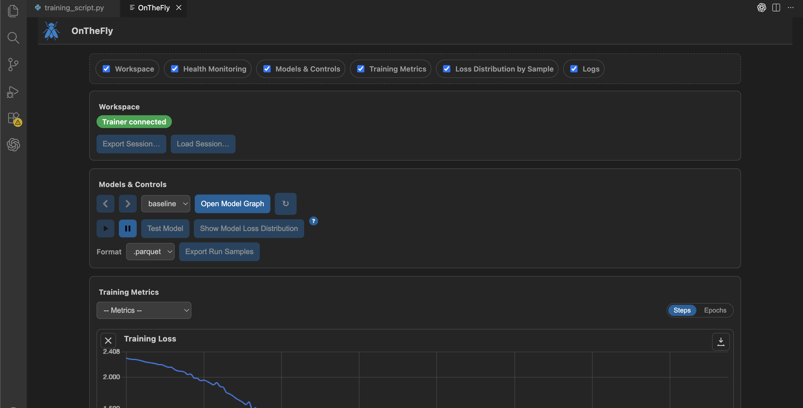

# OnTheFly

**OnTheFly** brings continuous model development, logging, experiment tracking, and mid-training actions into one place: your IDE. OnTheFly is a VS-Code training console with live dashboard controls, supporting pausing and resuming, importing and exporting sessions, customizable Adaptive Boosting (forking, merging), and training diagnostics.

With OnTheFly, you can make incremental, interactive progress on model development. When you start a long run, you can now see and do more during training with OnTheFly. Detect subtle faults in your model before training goes haywire. 

Being able to test, save a model, and continue training seamlessly is another big time saver. Many engineers quit training after seeing validation error increase when the model fits the training data, but double descent is a common theme in some setups.



OnTheFly turns that into an interactive loop:

- watch per-sample loss and slices **while you train**
- pause to inspect hard examples or drift
- fork short-budget specialists on rough regions
- merge improvements back into a single exportable model

All of this runs **fully offline** in a local VS Code extension — no accounts, no tokens, no external services.

This shifts training from a fixed, single-pass run into an incremental process that can be revisited and extended as new data arrives. Any previous session can be resumed with its full optimizer state, enabling controlled continuation rather than full retrains. Real-time visibility into failure regions turns continuous improvement into a measurable, iterative workflow rather than a periodic batch job.


> [!IMPORTANT]
> **Project status: Beta.** APIs, UI flows, and file formats may change before v1.0. Expect rough edges and please report issues. Currently, the console only supports PyTorch modules and Lightning trainers, in addition to our native trainer.
---

## When should you use OnTheFly?

OnTheFly is aimed at people who:

- train **PyTorch models** (classification, regression, etc.) and want more actionability than TensorBoard/print logs
- are currently using no trainer or a lightning trainer
- prefer a **local, offline** workflow inside VS Code rather than cloud dashboards

---

## Getting Started

### Install

```bash
pip install onthefly-ai
```

**Requirements**

* Python ≥ 3.9
* PyTorch ≥ 2.2 (CUDA 12.x optional)
* OS: Linux, macOS, or Windows
* Visual Studio Code

### Open the VS Code dashboard

1. Open VS Code → Command Palette (`Ctrl/Cmd + Shift + P`).
2. Select the **“OnTheFly: Show Dashboard”** command.
3. Run your training script in a terminal (or notebook) so it instantiates `Trainer.fit(...)`.
4. The dashboard status badge turns green once a Trainer connects; metrics/controls stream automatically while the tab is open. An idle Trainer does not mean the dashboard lost connection, it just means your model is not currently training.


### Quickstart with OnTheFlyTrainer

```python
import torch, torch.nn as nn
from torch.utils.data import DataLoader, TensorDataset
from onthefly import Trainer

# toy dataset
X = torch.randn(4096, 28 * 28)
y = (X[:, :50].sum(dim=1) > 0).long()
ds = TensorDataset(X, y)
train = DataLoader(ds, batch_size=128, shuffle=True)
val = DataLoader(ds, batch_size=256)
test = DataLoader(ds, batch_size=256)

# tiny model
model = nn.Sequential(nn.Linear(28 * 28, 64), nn.ReLU(), nn.Linear(64, 2))
opt = torch.optim.Adam(model.parameters(), lr=1e-3)
loss = nn.CrossEntropyLoss()

trainer = Trainer(
    project="mnist-demo",
    run_name="baseline",
    max_epochs=1,
    do_test_after=True,
    val_every_n_epochs=1,
)

trainer.fit(
    model=model,
    optimizer=opt,
    loss_fn=loss,
    train_loader=train,
    val_loader=val,
    test_loader=test,
)
```

### Quickstart with Lightning Trainer

```python

import os
import sys
from pathlib import Path

import lightning as L
import torch
import torch.nn as nn
from torch.utils.data import DataLoader, TensorDataset

from onthefly import attach_lightning


class LitClassifier(L.LightningModule):
    def __init__(self):
        super().__init__()
        self.net = nn.Sequential(nn.Linear(32, 64), nn.ReLU(), nn.Linear(64, 2))
        self.loss = nn.CrossEntropyLoss()

    def forward(self, x):
        return self.net(x)

    def training_step(self, batch, batch_idx):
        x, y = batch
        logits = self(x)
        loss = self.loss(logits, y)
        self.log("loss", loss, prog_bar=True)
        return loss

    def configure_optimizers(self):
        return torch.optim.Adam(self.parameters(), lr=1e-3)


def main():
    # -------------------------------
    # Toy data: train / val / test
    # -------------------------------
    x = torch.randn(2048, 32)
    y = (x[:, :4].sum(dim=1) > 0).long()

    ds = TensorDataset(x, y)
    train_ds, val_ds, test_ds = torch.utils.data.random_split(
        ds, [1536, 256, 256], generator=torch.Generator().manual_seed(0)
    )

    train_loader = DataLoader(train_ds, batch_size=64, shuffle=True)
    val_loader = DataLoader(val_ds, batch_size=128, shuffle=False)
    test_loader = DataLoader(test_ds, batch_size=128, shuffle=False)

    model = LitClassifier()
    trainer = L.Trainer(max_epochs=5, callbacks=[])

    # ----------------------------------------------
    # IMPORTANT CONTRACT for attach_lightning:
    #   - loss function be callable as loss_fn(logits, targets)
    #     (this is what auto-test uses)
    # ----------------------------------------------
    criterion = nn.CrossEntropyLoss()

    def otf_loss_fn(*args):
        """
        Dual-mode loss function:

        1) Lightning / auto-test path:
               loss = otf_loss_fn(logits, targets)

        2) Native OnTheFly-style path:
               loss = otf_loss_fn(batch, model, fwd_out)

           where:
               batch   = (x, y)
               model   = nn.Module
               fwd_out = model(x) or None
        """
        if len(args) == 2:
            # Called as (logits, targets) -> standard criterion
            logits, y = args
            return criterion(logits, y)

        if len(args) == 3:
            # Called as (batch, model, fwd_out) -> native-style helper
            batch, model, fwd_out = args
            x_b, y_b = batch
            logits = fwd_out if fwd_out is not None else model(x_b)
            return criterion(logits, y_b)

        raise TypeError(
            f"otf_loss_fn expected either (logits, targets) or "
            f"(batch, model, fwd_out), but got {len(args)} positional args."
        )

    delegate = attach_lightning(
        trainer=trainer,
        model=model,
        datamodule=None,
        project="demo",
        run_name="lightning-baseline",
        loss_fn=otf_loss_fn,
        train_loader=train_loader,
        val_loader=val_loader,
        test_loader=test_loader,
        do_test_after=True,
    )

    trainer.fit(model, train_loader)


if __name__ == "__main__":
    main()

```
 -Run your script exactly as you normally would (`python train.py` or `python -m training`); if the script instantiates a `Trainer`, the VS Code dashboard will attach automatically (it listens on `localhost:47621`) whenever a dashboard tab is open.
 - Once you run your script, you will see this in your terminal: [onthefly] dashboard connected on tcp://127.0.0.1:47621. This means that even if your dashboard wasn't open yet, you can still open the dashboard from the Command Palette (Cmd+Shift+P) and you will see the live training.
 -Instantiating this Trainer will wrap around your training, just like tools like Lightning and Accelerate do. Now you can perform actions on your model from the dashboard.
 -To exit the Trainer, use Ctrl+C from the terminal to close the dashboard connection.

`Trainer` skips validation unless you pass `val_every_n_epochs`. Set it to the cadence you need (e.g., `1` for every epoch); omit or set `0` to disable validation entirely. When `do_test_after=True`, the automatic evaluation runs once the stop condition hits, and then the trainer keeps streaming so you can continue interacting with the run from VS Code.

> **Sessions & storage**
>
> Every session is **ephemeral** in storage: when a new session begins, the previous session’s storage is cleaned up.
> Exporting a session is equivalent to saving a session.

---

### Lightning integration

OnTheFly can also attach to an existing **PyTorch Lightning** training loop. Install the optional extra:

```bash
pip install "onthefly_ai[lightning]"
```

Then wrap your Lightning `Trainer` before calling `fit`:

```python
import lightning as L
from onthefly.wrappers.lightning import attach_lightning

model = LitClassifier()
trainer = L.Trainer(max_epochs=5, callbacks=[])

attach_lightning(
    trainer=trainer,
    model=model,
    datamodule=data_module,
    project="mnist-demo",
    run_name="lightning-baseline",
    loss_fn=model.loss,
)

trainer.fit(model, datamodule=data_module)
```

Provide your Lightning loss module (and optional explicit dataloaders) so OnTheFly can compute per-sample losses for reports, subsets, forks, and merges.

The dashboard will stream `trainStep`, epoch logs, pause/resume events, and checkpoint notifications exactly like the native OnTheFly trainer. Generate-report, fork, and merge workflows operate on the Lightning model/dataloaders you supplied, so you can pause from VS Code, inspect losses, fork subsets, merge checkpoints, and resume the Lightning loop without leaving the IDE.

### Model factories & non-picklable attachments

When the dashboard generates a report, forks, or merges runs, it needs to spin up a fresh copy of your model so it can load checkpoints without touching the active trainer. OnTheFly now strips common non-picklable attachments (Lightning trainers, TensorBoard loggers, etc.) before cloning.

Some projects still require explicit constructor arguments (e.g., GANs composed from several modules). Provide a `model_factory` when calling `attach_lightning` so OnTheFly can respawn the module on demand:

```python
def build_model():
    generator = EventsModule(hparams, emb_dict=dm.embeddings_dict)
    return AdversarialEventsModule(hparams, dm.embeddings_dict, generator)

attach_lightning(
    trainer=trainer,
    model=model,
    project="demo",
    run_name="lightning-baseline",
    loss_fn=model.loss,
    train_loader=train_loader,
    val_loader=val_loader,
    test_loader=test_loader,
    model_factory=build_model,
)
```

If your model cannot be deep-copied (custom allocators, fabric handles, etc.), the factory is the required escape hatch and keeps the contract surface limited to `attach_lightning(...)`.

`attach_lightning` also accepts structured factories for convenience:

```python
attach_lightning(
    ...,
    model_factory=(
        AdversarialEventsModule,            # callable or class
        (hparams, dm.embeddings_dict, generator),  # positional args
        {"freeze_discriminator": False},    # keyword args
    ),
)
```

or

```python
attach_lightning(
    ...,
    model_factory={
        "factory": build_model,
        "args": (hparams, extra_config),
        "kwargs": {"embedding_dict": dm.embeddings_dict},
    },
)
```

Either form yields a closure that OnTheFly can call whenever it needs to reload a checkpoint, so you don’t have to wrap everything in a lambda manually.

---


## Features

**Mid-training control & visibility**
- Start and control training from the VS Code dashboard.
- Stream per-sample loss (optionally grad-norm, margin) with robust quantiles to surface loss tails early.
- Run mid-run health check-ups to detect instability and configuration issues before they cascade.

**Fork, specialize, and merge**
- Fork short-budget specialists from high-loss tails or residual clusters, then route with a lightweight gate.
- Compare experts side-by-side on target slices.
- Merge via SWA, distillation, Fisher Soup, or adapter fusion; view model lineage (parent/children) before committing.

**Data & sessions**
- One-click export of indices/rows for any slice to CSV / Parquet / JSON.
- Ephemeral sessions: storage is cleared when a new session begins; exporting is how you save.
- Portable sessions: exported sessions include the final model and can be re-imported to run tests, reports, or further training.

**Training backend**
- OnTheFly owns training process for any `torch.nn.Module` (including custom ones) and standard `DataLoader`s.
- Actions like pauses, forks, resumes, and loaded sessions are deterministic, with a surfaced determinism “health check” for monitoring.
- Supports Automatically Mixed Precision (AMP) training.
- Seamless continuation of training after tests, whether they were triggered automatically or manually.

---

## Manual human-in-the-loop

Instead of trusting a long run and hoping for the best, you keep tight control over when to pause, inspect, fork, and merge — with deterministic actions and evidence in front of you.

**What you can do**

* **Pause/Resume** at any time to take a clean snapshot.
* **Inspect before acting**: View per-sample loss distributions, export subsets for offline analysis.
* **Approve or edit plan cards** prior to execution.
* **Compare experts** on target slices.
* **Merge on your terms** via SWA / Distill / Fisher Soup / adapter fusion.
* **Run health check-ups mid-run** to validate determinism, gradients, and metrics before committing to longer budgets.
* **Export & import sessions** knowing that exported sessions include the final model and can later be imported, tested, and trained further.

**Typical manual loop**

1. Pause when drift or a weak slice appears.
2. Inspect loss tails, export a subset for a quick notebook check.
3. Fork a short-budget specialist for chosen samples, with desired parameters.
4. Evaluate on target slices; iterate if needed.
5. Merge improvements and resume training.
6. Export the session for traceability, or import a prior session to continue training or generate reports.


## Method (at a glance)

> Train a generalist, detect hard cases, focus on those specialists, learn a gating network, and export a unified MoE for inference. Or, don't use forking at all; simply manage your model development from VS Code without connecting to any externals or cloud.

1. Train a compact **generalist** on all data.
2. **Hard-sample mining** flags high-loss examples online.
3. **Clustering** groups hard samples into candidate regimes.
4. Boost rough areas of the loss curve by forking specialists.
5. Choose a **gating network** to unify experts.
6. **Benchmark fairly** against a monolithic baseline with matched compute.


## License

This project is licensed under the MIT License – see the LICENSE.txt file for details.

---

## Citation

If you use this project in research, please cite:

```bibtex
@software{onthefly2025,
  title        = {OnTheFly: Human-in-the-Loop ML Orchestrator},
  author       = {Luke Skertich},
  year         = {2025},
  url          = {https://github.com/KSkert/onthefly}
}
```
